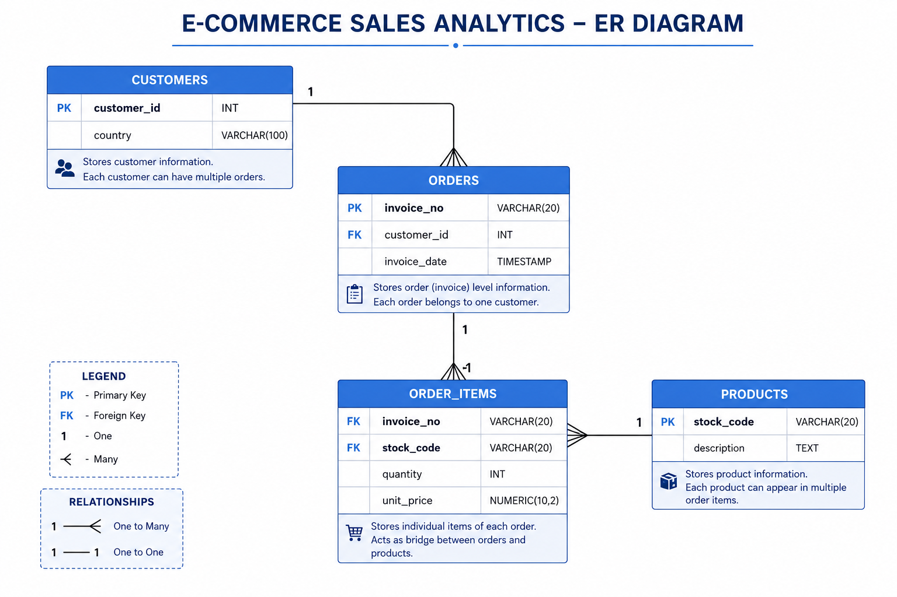

# 📊 E-Commerce Sales Analytics using PostgreSQL

A complete SQL data analytics project built using **PostgreSQL**. This project demonstrates database design, SQL querying, joins, aggregations, Common Table Expressions (CTEs), and Window Functions using a real-world E-Commerce sales dataset.

---

## 📌 Project Objectives

- Design a normalized relational database
- Import and manage sales data
- Perform business analysis using SQL
- Practice intermediate PostgreSQL concepts
- Build a portfolio-ready SQL project

---

## 🛠 Tech Stack

- PostgreSQL
- pgAdmin 4
- SQL
- Git & GitHub

---

# 📂 Repository Structure

```text
E-Commerce-Sales-Analytics-SQL/
│
├── screenshots/
│
├── E-Commerce-Sales-Analytics-SQL.sql
│
├── ER_Diagram.png
│
└── README.md
```

---

# 🗄 Database Schema

The database consists of four normalized tables.

### Customers

| Column | Type |
|---------|------|
| customer_id | INT (Primary Key) |
| country | VARCHAR(100) |

---

### Orders

| Column | Type |
|---------|------|
| invoice_no | VARCHAR(20) (Primary Key) |
| customer_id | INT (Foreign Key) |
| invoice_date | TIMESTAMP |

---

### Products

| Column | Type |
|---------|------|
| stock_code | VARCHAR(20) (Primary Key) |
| description | TEXT |

---

### Order_Items

| Column | Type |
|---------|------|
| invoice_no | VARCHAR(20) (Primary Key, Foreign Key) |
| stock_code | VARCHAR(20) (Primary Key, Foreign Key) |
| quantity | INT |
| unit_price | NUMERIC(10,2) |

---

# 🏗 Entity Relationship Diagram



---

# 🔗 Database Relationships

- One Customer can place many Orders.
- One Order contains many Order Items.
- One Product can appear in many Order Items.
- Order_Items acts as the bridge table between Orders and Products.

---

# 📚 SQL Concepts Covered

## Basic SQL

- SELECT
- WHERE
- ORDER BY
- LIMIT
- DISTINCT

## Aggregate Functions

- COUNT()
- SUM()
- AVG()
- MIN()
- MAX()

## Grouping

- GROUP BY
- HAVING

## Joins

- INNER JOIN
- LEFT JOIN

## Common Table Expressions (CTEs)

- WITH

## Window Functions

- ROW_NUMBER()
- RANK()
- DENSE_RANK()

---

# 📈 Business Analysis Performed

✔ Total Revenue

✔ Total Customers

✔ Total Orders

✔ Top Selling Products

✔ Highest Revenue Products

✔ Top Customers by Revenue

✔ Country-wise Sales

✔ Monthly Sales Trend

✔ Average Order Value

✔ Customer Purchase Frequency

✔ Product Revenue Ranking

✔ Customer Ranking using Window Functions

---

# 💻 Sample SQL Query

## Top 10 Customers by Revenue

```sql
SELECT
    c.customer_id,
    SUM(oi.quantity * oi.unit_price) AS total_spent
FROM customers c
JOIN orders o
    ON c.customer_id = o.customer_id
JOIN order_items oi
    ON o.invoice_no = oi.invoice_no
GROUP BY c.customer_id
ORDER BY total_spent DESC
LIMIT 10;
```

---

# 📷 Project Screenshots

The query outputs are available inside the **screenshots** folder.

Example:

- Customer Analysis
- Revenue Analysis
- Product Ranking
- Window Functions

---

# 🎯 Key Learnings

- Relational Database Design
- Primary & Foreign Keys
- Database Normalization
- SQL Joins
- Aggregate Functions
- Common Table Expressions
- Window Functions
- Business Analytics using SQL

---

# 🚀 Future Improvements

- SQL Views
- Stored Procedures
- Indexing
- Power BI Dashboard
- Tableau Dashboard
- Customer Segmentation
- Sales Forecasting

---

# ⭐ Project Highlights

- ✔ End-to-End SQL Project
- ✔ Normalized Database Design
- ✔ Professional ER Diagram
- ✔ Real Business Analysis
- ✔ Portfolio Ready
- ✔ Beginner to Intermediate PostgreSQL Concepts

---

## 👨‍💻 Author

**Soumit Barate**

GitHub: https://github.com/SoumitBarate

---

### ⭐ If you found this project useful, don't forget to Star this repository!
